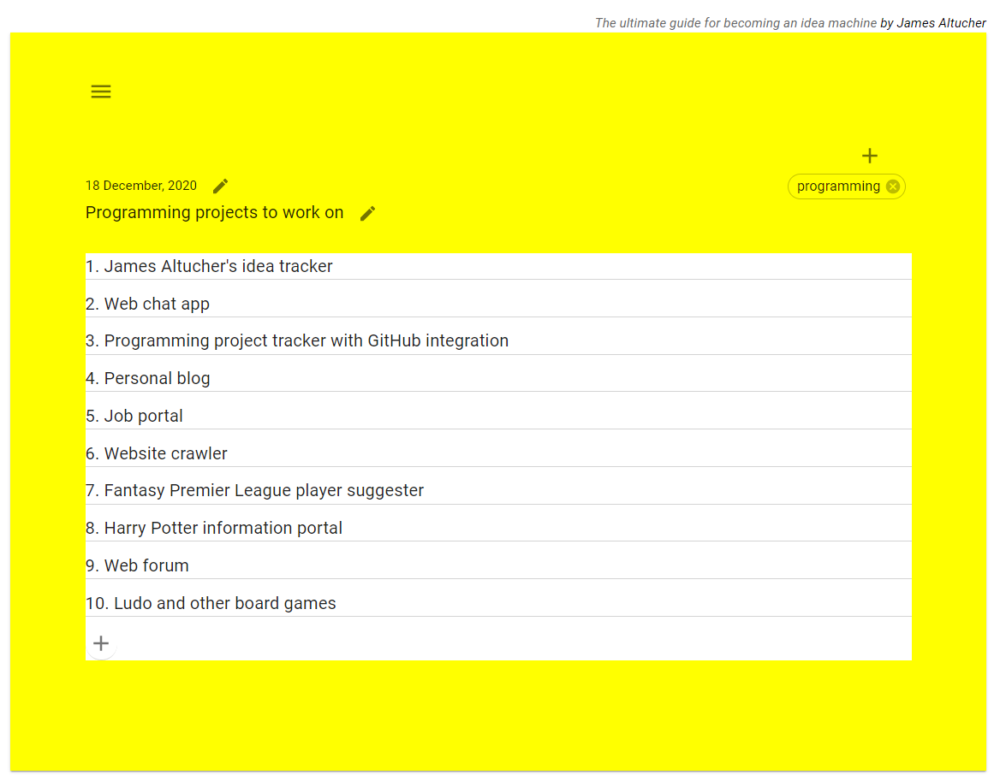
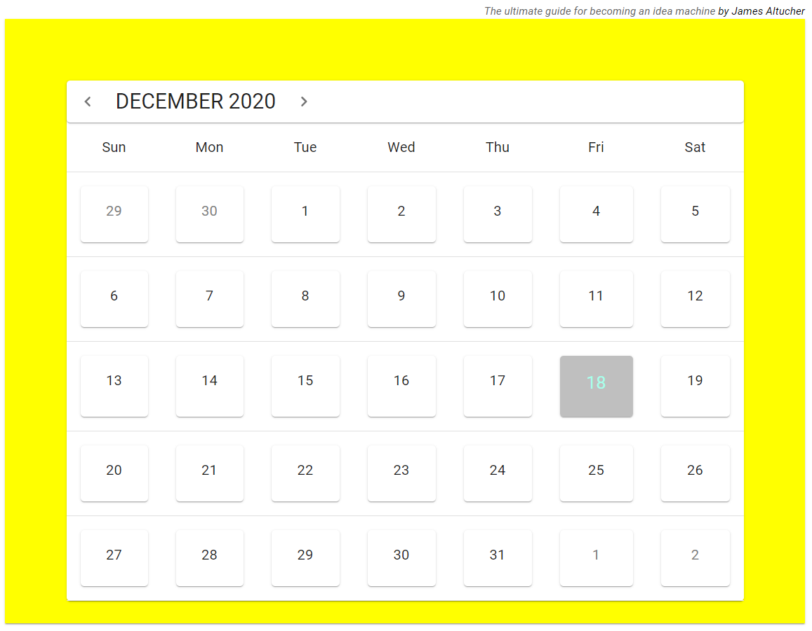
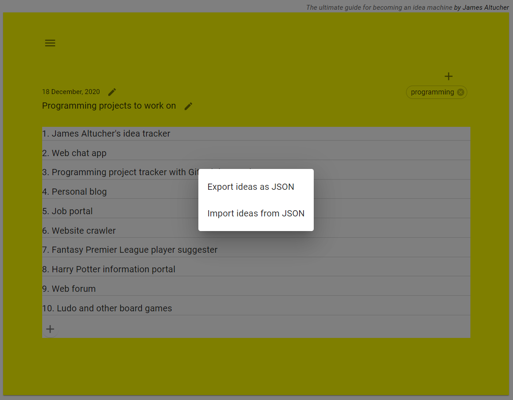

# My Ideas

1. [Introduction](#introduction)
2. [Getting Started](#getting-started)
3. [Usage](#usage)
4. [Screenshots](#screenshots)
5. [Known Issue](#known-issue)
6. [Dependencies](#dependencies)
7. [Technical Notes](#technical-notes)

## Introduction

My Ideas is a small project based on James Altucher's [Ultimate Guide for becoming an Idea Machine](https://jamesaltucher.com/blog/the-ultimate-guide-for-becoming-an-idea-machine/).

Using the application, you can:
1. Add one title for each day.
2. Under each title, you can at up to 20 ideas.
3. Add tags to titles.
4. Import and Export ideas as JSON.

## Getting Started

1. Clone the repo

2. In the project directory, install all the dependencies using:

  `yarn`

3. Run the project using:

  `yarn start`

The app runs on http://localhost:3000.

## Usage

The home page opens with the current day's title. Here, you can:

1. Edit the **Title**.
2. Add/Edit/Delete **Ideas**.
3. Add/Edit/Delete **Tags**.
4. Select a **Tag** to see all the titles associated with the tag.
  - Click a title to go back to the ideas page.
5. Edit the **Date** to display the Calendar.
  - Select a date to go back to the ideas page.

## Screenshots

1. Home page

2. Calendar

3. Import and export ideas

## Known Issue

1. Clicking on the **Edit** and **Delete** icons don't work as expected. You have to click on the button but not on the icon to make them work.

## Dependencies

1. @material-ui/core ^4.11.1
2. @material-ui/icons ^4.11.2
3. date-fns ^1.30.1
4. react-material-ui-calendar ^0.2.3

## Technical Notes

1. The app uses browser's local storage to store the ideas. So make sure to export your ideas before clearing browser data.

2. You can edit the functions inside `src/helpers/storage.js` to implement data storage using API, database, or files.

3. Importing ideas deletes the ideas existing on the website. So, make sure to backup existing ideas before importing new ones. Feature to merge multiple exports coming soon.
